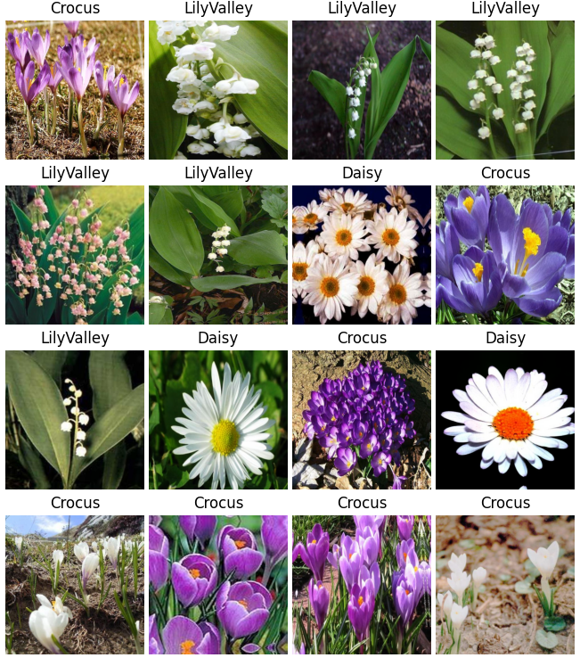
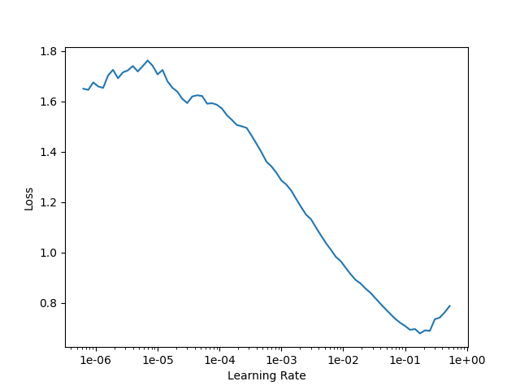

# Imports and setup

```{r}
library(reticulate)
```

```{r}
use_python('/anaconda3/envs/fastai_in_R/bin/python', required = TRUE)
use_condaenv('fastai_in_R')
py_config()
```

I am using a Conda environment setup (on a Mac) with the following lines
```
conda create fastai_in_R python=3.7
conda activate fastai_in_R

conda install pytorch torchvision -c pytorch
pip install fastai
pip install opencv-python
```

```{r}
py_run_string('
from fastai.vision import *
from pathlib import Path
import pandas as pd

DATASET_FOLDER = Path("flowers/data")
              ')
```

# Prepare data

```{r}
py_run_string('
df = pd.read_csv(Path("flowers/model_training/data_labels.csv"))

img_size = (500, 500)
batch_size = 16

src = ImageList.from_df(df, cols="image", path=DATASET_FOLDER)
src_labelled = src.split_from_df("is_valid").label_from_df(cols="label")
data = (src_labelled.transform(get_transforms(), size=img_size).databunch(bs=batch_size))

print(df)
              ')
```

```{r}
py_run_string('
data.show_batch()
')
```


# Define learner

```{r}
py_run_string('
learn = cnn_learner(data, models.squeezenet1_0, metrics=[accuracy])
learn.model_dir = "model"

learn.lr_find();
fig = learn.recorder.plot(return_fig=True)
fig.savefig("lr_find_py.png")
              ')
```


# Fit learner

```{r}
py_run_string('
initial_lr = 1e-03
n_epochs = 3

learn.fit_one_cycle(n_epochs,  max_lr=initial_lr)
                ')
```

```{r}
py_run_string('
interp = ClassificationInterpretation.from_learner(learn)

fig = interp.plot_confusion_matrix(figsize=(10, 10), return_fig=True)
fig.savefig("confusion_matrix_py.png")
')
```

