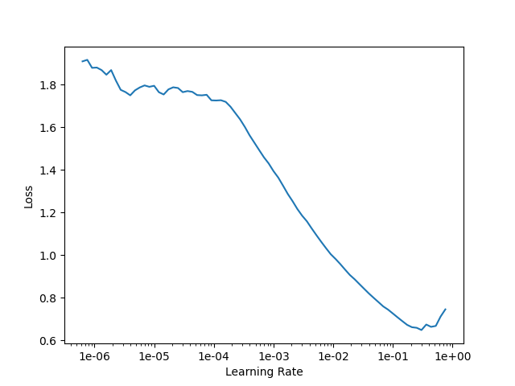
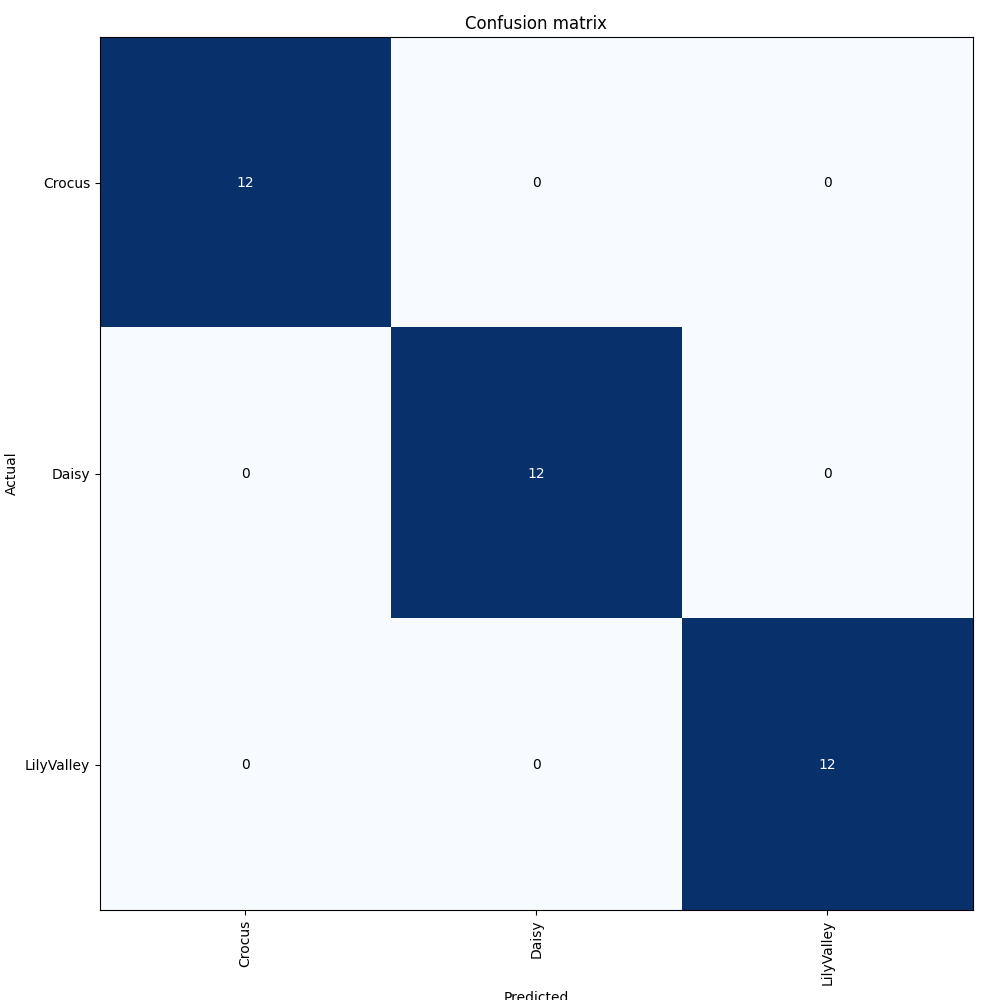

In this notebook we train a fast.ai model for image classification, almost all is done in R.

# Imports and setup

```{r}
# import R libraries
library(reticulate)

library(tibble)
library(tidyr)
library(stringr)
library(jpeg)
library(knitr)
suppressMessages(library(dplyr))
```

Load the Python environment in which we can execute the model
```{r}
use_python('/anaconda3/envs/fastai_in_R/bin/python', required = TRUE)
use_condaenv('fastai_in_R')
py_config()
```

I am using a Conda environment setup (on a Mac) with the following lines
```
conda create fastai_in_R python=3.7
conda activate fastai_in_R

conda install pytorch torchvision -c pytorch
pip install fastai
pip install opencv-python
```

Import Python libraries
```{r}
fastai <- import('fastai.vision')
```

# Get images list
```{r}
DatasetFolder <- file.path(getwd(), 'flowers', 'data')

df <- read.csv(file.path(getwd(),'flowers', 'model_training', 'data_labels.csv'))
df$is_valid <- as.logical(df$is_valid) # This csv was prepared for Python type True/False
print(df)
include_graphics(file.path(DatasetFolder, df$image[[1]]))
```

# Databunch
```{r}
imgSize <- list(500L, 500L)
batchSize <- 16L
```

```{r}
src <- fastai$ImageList$from_df(df, cols='image', path=DatasetFolder)
srcLabelled <- src$split_from_df(col='is_valid')$label_from_df(cols='label')
data <- srcLabelled$transform(fastai$get_transforms(), size=imgSize)$databunch(bs=batchSize)$normalize(fastai$imagenet_stats)
```

# Create learner
```{r}
learn <- fastai$cnn_learner(data, fastai$models$squeezenet1_0, metrics=list(fastai$accuracy))
learn$model_dir <- "model"
```

# Find the right learning rate
```{r}
learn$lr_find()
```

```{r}
fig <- learn$recorder$plot(return_fig=TRUE)
fig$savefig("lr_find_r.png")
```


```{r}
initialLr <- 1e-03
nEpochs <- 3L

learn$fit_one_cycle(nEpochs, max_lr=initialLr)
```

```{r}
interp <- fastai$ClassificationInterpretation$from_learner(learn)
fig <- interp$plot_confusion_matrix(figsize=list(10L,10L), return_fig=TRUE)
fig$savefig("confusion_matrix_r.png")
```
